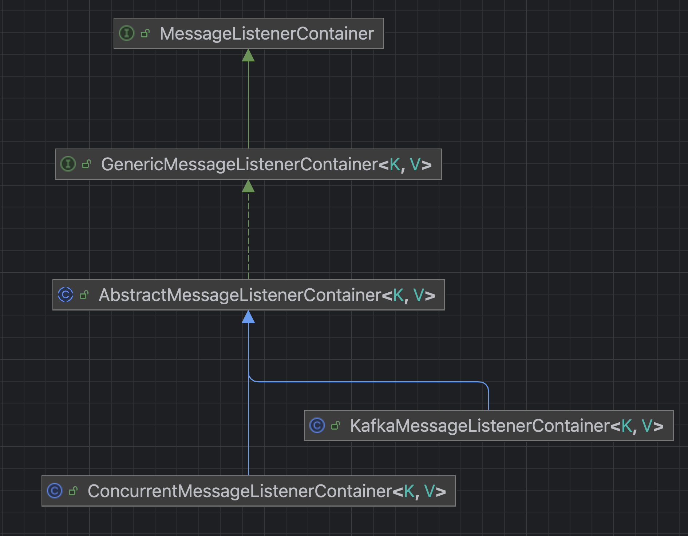
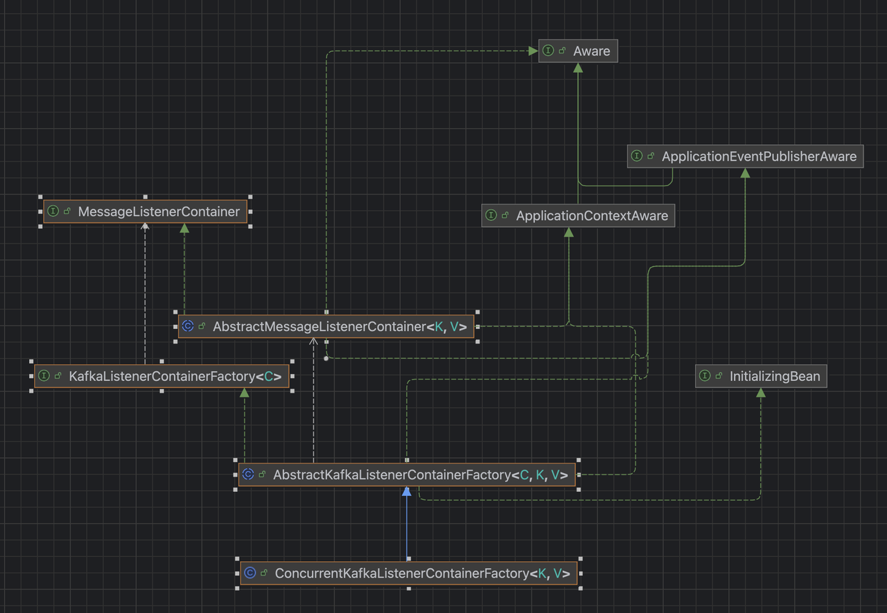
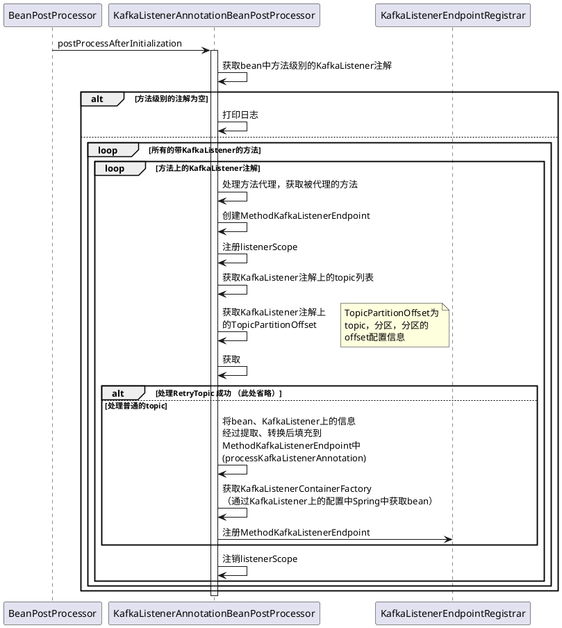
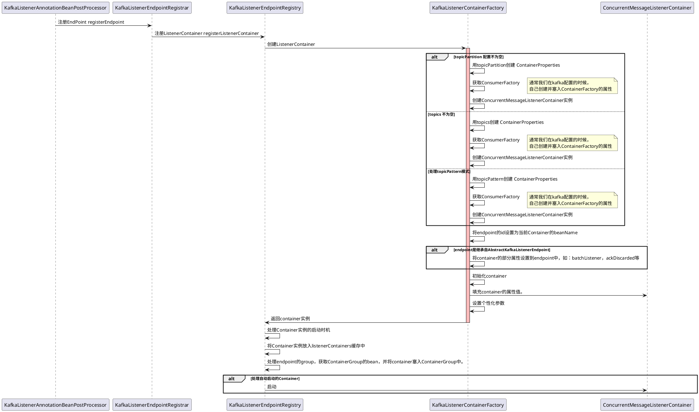
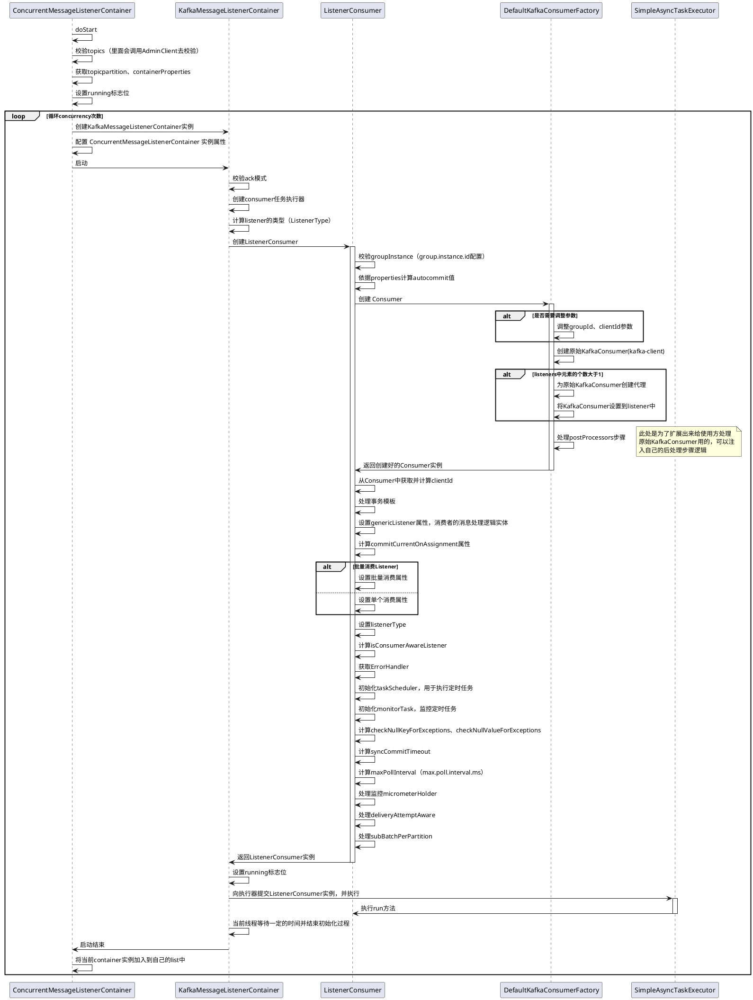

## 介绍
spring-kafka是一个脚手架，方便我们使用kafka，可以通过注解的方式创建kafka的监听实例，方便编程。其初始化过程主要包括两大核心即MessageListenerContainer与KafkaListenerContainerFactory内。在初始化过程中主要是完成创建接口GenericMessageListener的实例、创建consumer，向kafka集群注册消费者等步骤。

## MessageListenerContainer

继承与实现关系：

ConcurrentMessageListenerContainer与KafkaMessageListenerContainer是两个MessageListenerContainer的实现，一个是多线程的（ConcurrentMessageListenerContainer），一个是单线程的（KafkaMessageListenerContainer）。

## KafkaListenerContainerFactory

继承与实现关系：

## 初始化过程
利用spring的BeanPostProcessor机制触发KafkaListenerAnnotationBeanPostProcessor对bean的注解的扫描，当扫描到KafkaListener或KafkaListeners注解时，利用KafkaListenerEndpointRegistrar和KafkaListenerEndpointRegistry发起Container的创建。Container的创建使用了工厂模式，由KafkaListenerContainerFactory工厂创建Container。

### annotation注册过程

